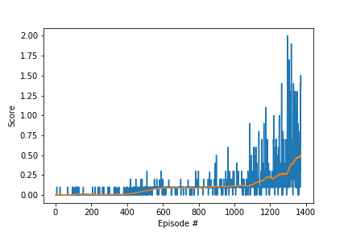

# Collaboration and Competition
### Summary
For this project, two agents were trained to bounce a ball over a net for as many time steps as possible.

A reward of +0.1 is provided for each step that the agent hits the bal over the net. If an agent lets a ball hit the ground or hits the ball out of bounds, it receives a reward of -0.01. The goal was to keep the vall in play and to get an average score of +0.5 over 100 consecutive episodes.

The observation space consists of 8 variables corresponding to the position and velocity of the ball and racket. Each agent receives its own, local observation. Two continuous actions are available, corresponding to movement toward (or away from) the net, and jumping.

Install the following packages using pip:
```
tensorflow==1.7.1
Pillow>=4.2.1
matplotlib
numpy>=1.11.0
jupyter==1.0.0
pytest>=3.2.2
docopt==0.6.2
pyyaml
protobuf==3.5.2
grpcio==1.11.0
torch==0.4.0
pandas==0.23.1
scipy==1.2.0
ipykernel==4.10.0
```

Then download the environment from one of the following links:

Linux: [click here](https://s3-us-west-1.amazonaws.com/udacity-drlnd/P3/Tennis/Tennis_Linux.zip)
    
Mac OSX: [click here](https://s3-us-west-1.amazonaws.com/udacity-drlnd/P3/Tennis/Tennis.app.zip)
    
Windows (32-bit): [click here](https://s3-us-west-1.amazonaws.com/udacity-drlnd/P3/Tennis/Tennis_Windows_x86.zip)
    
Windows (64-bit): [click here](https://s3-us-west-1.amazonaws.com/udacity-drlnd/P3/Tennis/Tennis_Windows_x86_64.zip)

Then run second and third cells to import the necessary packages and create an agent and an environment, fourth cell to train the agent and fifth cell to test the agent.

### Implementation
The agent is initialised with state size and action size in maddpg_agent.py. The goal is to estimate the optimal policy that maximizes the cumulative reward. In this case a multi-agent deep deterministic policy gradient algorithm is used as an approximate actor-critic method. Each agent uses 4 neural networks to solve the environment, a target and a local network for both actor and critic.

The actor neural network consists of two hidden layers with 200 and 150 nodes respectively. All two layers have a ReLU activation function and the output layer is followed by a tanh function. The network takes a state as an input and outputs an action-value function for corresponding state.

The critic neural network consists of two hidden layers with 200 and 150 nodes respectively. Both layers have a ReLU activation function. The neural network takes state and action of all agents from buffer as an input and outputs based on action-value function calculated by the actor.

### Training
After resetting the environment the agent takes a state as an input and outputs an action for this state. Then the environment returns the next state, rewards and dones parameters. The agent takes the next step, saves the observed experience in a shared replay memory and calls the learn method.

The agent solved the environment in 1372 episodes and the received score after each episode can be seen below.



### Parameters used to achieve this result:
| parameter | value |
| --- | --- |
| BUFFER_SIZE | 100000 |
| BATCH_SIZE | 250 |
| GAMMA | 0.99 |
| TAU | 0.001 |
| LR_ACTOR | 0.0001 |
| LR_CRITIC | 0.001 |
| WEIGHT_DECAY | 0 |

Buffer size is the size of replay buffer while batch size is the size of sampled minibatch of replay buffer. &gamma; is discount factor in Bellman equation. &tau; is for soft update of target parameters. Weight decay is a factor for $L_{2}$ regularization used in training the actor or critic function approximator. The model weights of the successful agent can be found in agent1_checkpoint_actor.pth, agent2_checkpoint_actor.pth, agent1_checkpoint_critic.pth and agent2_checkpoint_critic.pth.

### Ideas for future work
We can modifying the hyperparameters using framework such as Optuna. Alternatively we can consider using the multi-agent variant of PPO (MAPPO).